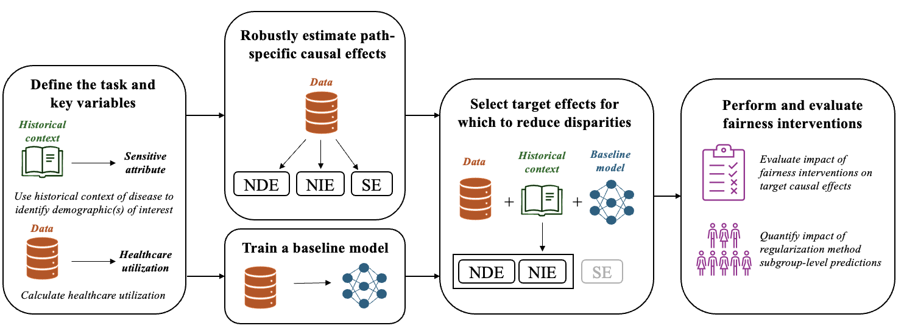

# A pipeline for enabling path-specific causal fairness in observational health data

This repository contains the code used in [A pipeline for enabling path-specific causal fairness in observational health data](https://arxiv.org/abs/2505.16953), a pipeline for mapping observational health data to the structural fairness model, prioritizing paths of known healthcare bias, and enforcing path-specific causal fairness along these paths. 

When training machine learning (ML) models for potential deployment in a healthcare setting, it is essential to ensure that they do not replicate or exacerbate existing healthcare biases. Although many definitions of fairness exist, we focus on path-specific causal fairness, which allows us to better consider the social and medical contexts in which biases occur (e.g., direct discrimination by a clinician or model versus bias due to differential access to the healthcare system) and to characterize how these biases may appear in learned models. In this work, we map the structural fairness model to the observational healthcare setting and create a generalizable pipeline for training causally fair models. The pipeline explicitly considers specific healthcare context and disparities to define a target "fair" model. Our work fills two major gaps: first, we expand on characterizations of the "fairness-accuracy" tradeoff by detangling direct and indirect sources of bias and jointly presenting these fairness considerations alongside considerations of accuracy in the context of broadly known biases. Second, we demonstrate how a foundation model trained without fairness constraints on observational health data can be leveraged to generate causally fair downstream predictions in tasks with known social and medical disparities. This work presents a model-agnostic pipeline for training causally fair machine learning models that address both direct and indirect forms of healthcare bias.

## Requirements
All requirements are available as a `conda` enviornment under `causal_fairness_env.yml`. Additionally, the environment needed to run causal effect estimation is stored under `effect_estimates/environment.yml`
